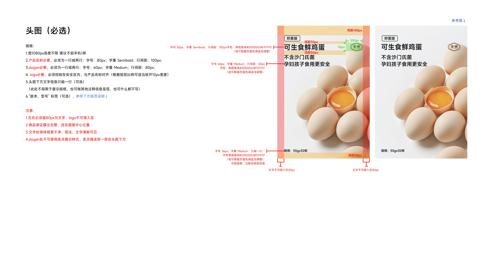
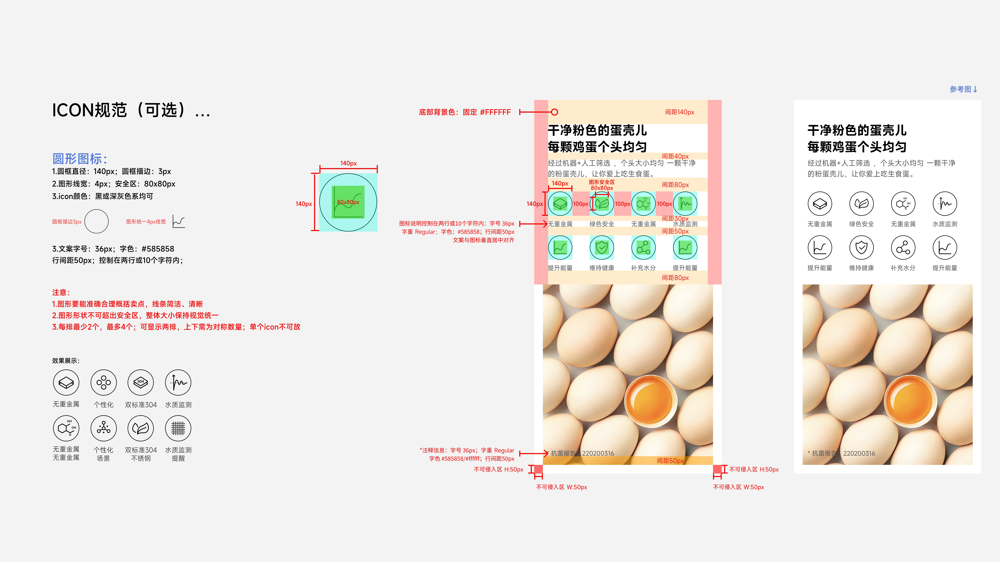

# 小米有品产品站设计规范 Skill

根据 47 张原始规范图片整理的 Codex skill，用于制作、还原与校对 **1080px 宽**的商品产品站长页。包含详细版式数值、正确模板、错误示范及修正方式，每条模块规范均可追溯原图。

技能入口：[SKILL.md](SKILL.md)。

## 规范预览

以下为来源规范板，包含尺寸标注与正确参考图。点击图片查看原图。

**头图规范**：产品名称、slogan、logo 的字体层级、间距和安全区。

[](references/source-images/S22.jpg)

**图形 ICON 规范**：圆框尺寸、线宽、图形安全区、文案对齐和正文组合版式，附成品参考。

[](references/source-images/S12.jpg)

## 安装

在 Codex 中发送：

```text
安装这个 skill：https://github.com/godm609-max/mi-product-site-spec
```

或将本仓库完整下载到 skills 目录，目录结构应为：

```text
~/.codex/skills/mi-product-site-spec/SKILL.md
~/.codex/skills/mi-product-site-spec/references/
~/.codex/skills/mi-product-site-spec/agents/
```

安装时保留 `references/source-images/`，后续才能核查原始标注和正误对照。

## 使用示例

```text
$mi-product-site-spec 为这个产品规划1080px产品站长页，给出模块、字号、间距和图片构图要求。
```

```text
$mi-product-site-spec 校对这份设计稿，按模块指出当前值、规范值、修正方式和来源编号。
```

```text
$mi-product-site-spec 检查头图中的版本标签、米家接入标识和主打卖点网格，辨别是否用了错误示范样式。
```

本技能提供规范知识与走查方式。需要生成商品摄影或场景图时，可结合用户已配置的图片生成工具；普通规范查询不需要 API key 或额外脚本。

## 内容导航

| 内容 | 文档 |
|---|---|
| 画布、MiSans 字阶、色值、安全区与取值原则 | [基础设计系统](references/foundations.md) |
| 头图、版本标签、米家接入标识、主打卖点网格 | [头图与主打卖点](references/hero-and-selling-points.md) |
| 图文结合/分开、图形 ICON、数字 ICON | [正文与图标](references/body-and-icons.md) |
| 2/3/4/6 图排版、列宽及卡片文案 | [多图展示](references/multi-image.md) |
| 细节宫格/横版、参数页、品牌介绍、获奖标识 | [细节与附属模块](references/details-parameters-brand.md) |
| FAQ 独立字号、间距和安全区 | [常见问题](references/faq.md) |
| 3 张错误示范板的具体问题与正确邻例 | [错误示范与修正](references/anti-patterns.md) |
| 原图笔误、标注差异与解释依据 | [证据与差异处理](references/evidence-notes.md) |
| 制作和走查时的逐项检查 | [校对清单](references/review-checklist.md) |
| 全部 47 张来源图及文件校验信息 | [原图索引](references/source-index.md)、[sources.json](references/sources.json) |

## 规则怎么取值

具体模块的明确标注优先于通用字阶示例；文字色号优先于 JPEG 取色；几何推导值与源图硬值分开记录。错误示范板中也有正确邻例，按红框与说明判断具体元素，不能把整张图一概判错。

本文档对应这批产品站规范。其他商城详情页、轮播图、PC 导航或响应式断点规则需要另行确认，不自动混用。MiSans 字体文件不随仓库提供，使用者按实际环境安装。

## 来源

规范文本依据所附 47 张原图提炼；原图整理于 2026-10-05。原文件名、尺寸、字节数、SHA-256、模块分类保存在 `references/sources.json`；原图副本用于核查规则和错误示范。示例商品、参数、认证、奖项和品牌内容需替换为实际产品资料。
